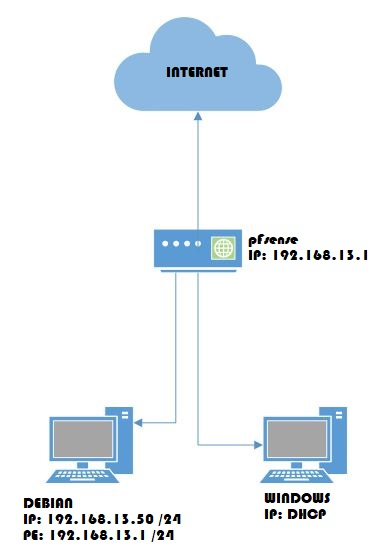
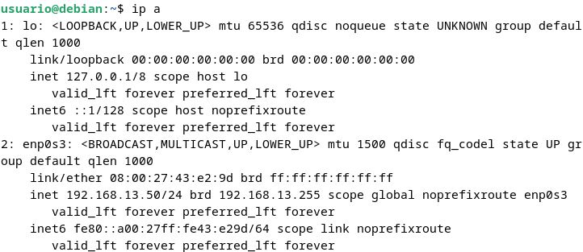

# Creación de servidor DHCP en Debian
Ander Pelayo Remesal   
Se realizara el ejemplo y la explicacion junto.

## Indice
[Introduccion](#1--introducción)  
[Configuración de red del equipo](#2--configuración-de-red-del-equipo)  
[Instalación del servidor](#3--instalación-del-servidor)  
[Configuracion del servidor](#4--configuracion-del-servidor)  
[Comprobacion con el cliente](#5--comprobacion-con-el-cliente)  

### 1- Introducción
En este tutorial vamos a crear un servidor DHCP desde un equipo Debian. Para este usaremos el servicio `isc-dhcp-server`. A continuacion podremos ver un pequeño diagrama el cual indica como va a estar planteada nuestra red.   

### 2- Configuración de red del equipo
Para tener un servidor tendremos que tener el equipo Debian con una IP estatica, y configurada con la puerta de enlace del router.  
Si tenemos el Debian con interfaz grafica lo podremos realizar en modo grafico y despues comprobaremos la ip con el siguiente comando  
    
    ip a

   

Una vez configurados estos parametros nos tendremos que asegurar de que con esta configuracion tiene salida a internet ya que despues tendremos que instalar un paquete y sin internet no le prodiramos instalar.

### 3- Instalación del servidor
Ahora pasaremos a instalar el servidor en el equipo.   
El primer paso que tendremos que hacer (no recomendable) seria entrar en super usuario.   

    su -

Esto lo que hace es que no tengamos que poner `sudo` cada vez que queramos instalar o ejercutar algo que necesite administrador.   
El comando que tendremos que ejecutar para instalar el paquete es  

    apt install isc-dhcp-server

### 4- Configuracion del servidor
Ahora ya teniendo instalado el servicio pasaremos a configurar el servicio.   
Lo primero que tendremos que hacer es modificar el siguiente fichero. **ES RECOMENDABLE HACER COPIA DE SEGURIDAD DE LOS ARCHIVOS QUE HAY QUE MODIFICICAR**   
Comando para hacer la copia de seguridad   

    cp /etc/default/isc-dhcp-server /etc/default/isc-dhcp-server.backup   
    nano /etc/default/isc-dhcp-server

  

Aqui lo que tendremos que poner es en la interfaz v4 el nombre de nuestra interfaz.   
El siguiente paso es configurar los parametros del servidor DHCP, para hacer esto tendremos que ejecutar el siguiente comando.

    nano /etc/dhcp/dhcpd.conf

Lo que vemos en la siguiente imagen es la configuracion, en donde la subnet es la red, tambien podemos observar los rangos que tenemos delimitados en linux para delimitar los rangos tendremos que añadir mas `range`, tambien podemos observar los DNS con el DNS del instituto en este caso y el nombre de dominio que queramos, tambien vemos la puerta de enlace del router.  
Por ultimo vemos los tiempos configurados por si piede otra vez la IP, que tendra que esperar los tiempos configurados en este apartado.  

 

Lo que podemos observar en esta imagen es la configuracion del servicio:   
- Los `range` son los rangos de IP que se pueden conceder a los clientes por lo que segun podemos observar se podran asigar de la IP 192.168.13.2 a la 192.168.13.49 y de la 192.168.13.51 a la 192.168.13.100.  
- Pasando a la siguinete linea nos encontramos con la opcion `option domain-name-servers` que esto seria el DNS, en nuestro caso seria el DNS del instituto que seria 10.0.1.48.   
- La opcion de `option-domain-name` seria el nombre de dominio que el cliente debe usar para resolver nombres.   
- Y la opcion `option routers` que seria la ip de salida a internet, seria la IP que tenemos en el pfsense, para tener conexion a internet.   
Por ultimo vemos 3 opciones mas:  
- `default-lease-time` esta opcion es el tiempo de refresco de la IP.  
- `max-lease-time`  se utiliza para indicar el maximo tiempo de concesion de IP.  
- `min-lease-time`  se utiliza para indicar el minimo tiempo de concesion de IP.  
Tambien podremos crear reservas, este apartado normalmente viene con el nombre "FANTASIA".

Aqui podemos observar dos parametros que serian:   
- `hardware ethernet` esta seria la direccion MAC del la tarjeta de red a la que queremos asignar una IP especifica.  
- `fixed-address` esta es la IP que queremos reservar para el equipo de la direccion MAC anterior.

Una vez realizados todos estos cambios solo nos queda iniciar el servicio y verificar el estado. Para esto usaremos los comandos.  

    systemctl start isc-dhcp-server
    systemctl status isc-dhcp-server

Una vez arrancado nos riene ue quedar un mensaje tal y como vemos a continuacion.

Una vez arrancado correctamente tambien podremos ver los puertos, que saldran como la imagen que vemos a continuacion.

### 5- Comprobacion con el cliente
Finalmente iremos en este caso a un Windows 10, lo primero que tendremos que hacer es ir a configurar la tarjeta de red. Lo veremos a continuacion.

Y para ver la ip en el servidor tendremos que poner el siguiente comando.

    cat /var/lib/dhcp/dhcpd.leases

Veremos a continuacion el resultado que nos da.

